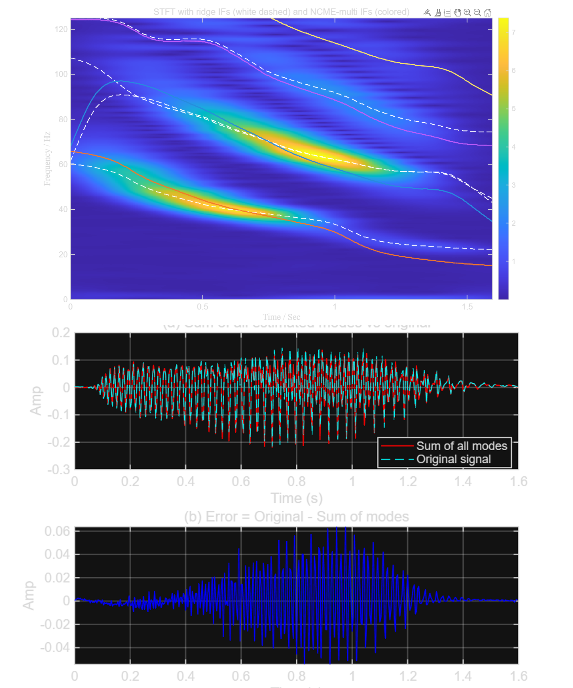
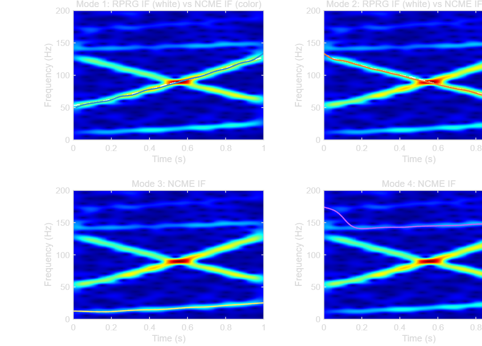
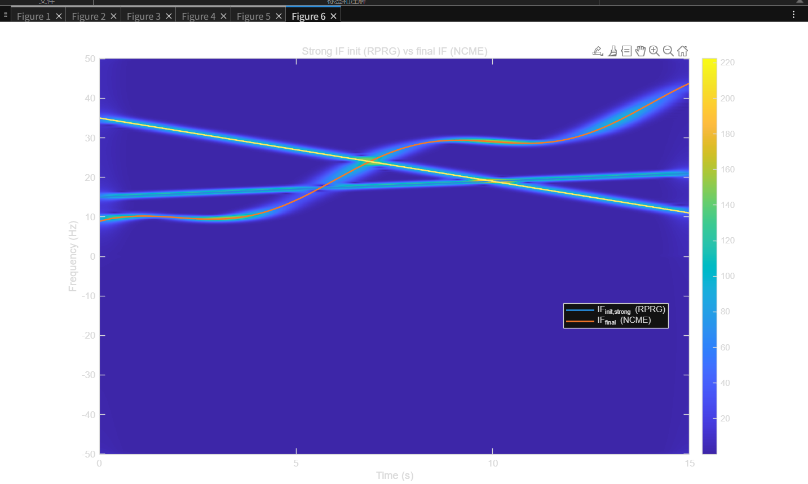

# Hybrid RPRG-Initialized NCME for Nonlinear Chirp Mode Estimation

**Note:** This work is based on and inspired by NCME (Tu et al., 2021), VNCMD (Chen et al., 2017), and RPRG (Chen et al., 2017).Parts of the implementation are adapted from external code.

This repository contains a MATLAB implementation of a hybrid pipeline for estimating and reconstructing multi-component **nonlinear chirp** modes under **crossings** and **large dynamic range**, where weak modes are often buried by residual artifacts from strong modes.

**Core idea:** use **RPRG** for crossing-aware ridge initialization, then apply **NCME (ADMM-style multi-mode joint refinement)** to jointly refine IF trajectories and reconstruct modes, improving weak-mode recovery.

---

## Method Overview

Main function is hybrid_RPRG_VNCMD_NCME

Pipeline (high level):

1. Compute time–frequency representation (STFT)
2. Extract strong-mode ridges via sequential ridge extraction, then **RPRG** to handle crossings
3. (Optional) refine ridge initialization with VNCMD
4. Use **NCME_multi** on the original signal to jointly refine strong modes
5. Add weak modes incrementally: detect ridge on the residual, then re-run **NCME_multi** for joint refinement

---

## Results (Examples)

### (A) Strong/weak separation + reconstruction
run("test6.m")

### (B) Crossing case: regrouping + joint refinement
run("Test3.m")

### (C) Multiple crossings: refined IF tracking
run("testncme2.m")

## Requirements
- MATLAB R20XXa (tested on: MATLAB R2025b (Windows 11))
- Dependencies: `STFT`, `extridge_mult`, `RPRG`, `NCME_multi`, `findridges`, `Dechirp_filter`, `curvesmooth`, (optional) `VNCMD`

> **Note:** Some dependencies are external implementations. See **Acknowledgements** below.

## References / Acknowledgements

This project builds on the following methods and papers:

- **NCME (Nonlinear Chirp Mode Estimation)** — sparse/greedy nonlinear chirp mode estimation with an efficient ADMM implementation.  
  X. Tu, J. Swärd, A. Jakobsson, and F. Li, *“Estimating nonlinear chirp modes exploiting sparsity,”* Signal Processing, 183, 107952, 2021.

- **VNCMD (Variational Nonlinear Chirp Mode Decomposition)** — variational demodulation-based decomposition for wide-band nonlinear chirp modes (optional refinement/smoothing in this repo).  
  S. Chen, X. Dong, Z. Peng, W. Zhang, and G. Meng, *“Nonlinear Chirp Mode Decomposition: A Variational Method,”* IEEE Transactions on Signal Processing, 65(22), 2017.

- **RPRG (Ridge Path Regrouping)** — ridge extraction and regrouping for overlapped/crossing components in the time–frequency plane.  
  S. Chen, X. Dong, G. Xing, Z. Peng, W. Zhang, and G. Meng, *“Separation of Overlapped Non-Stationary Signals by Ridge Path Regrouping and Intrinsic Chirp Component Decomposition,”* IEEE Sensors Journal, 17(18), 2017.

If you use this code in academic work, please cite the papers above.

